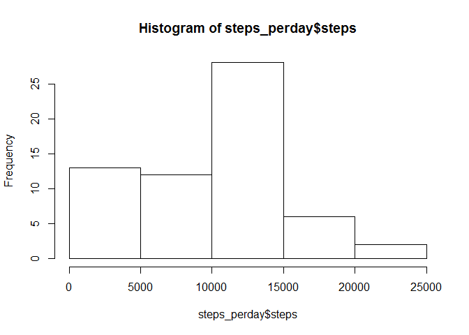
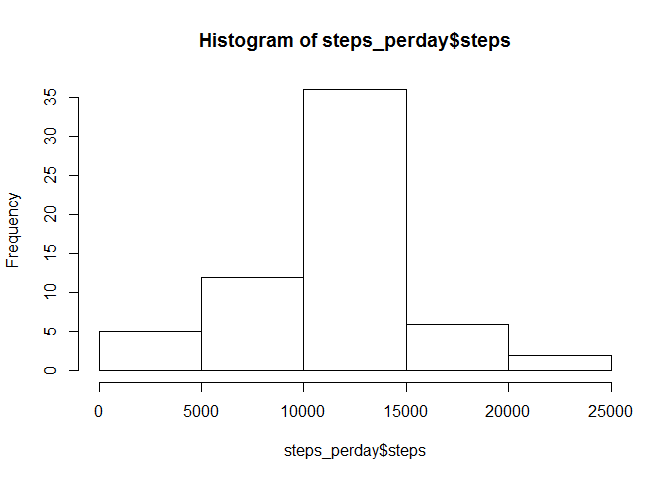

# Reproducible Research: Peer Assessment 1

## Loading and preprocessing the data

```r
setwd("D:/repository/RepData_PeerAssessment1")
activity_raw<-read.csv("activity.csv")
summary(activity_raw)
```

```
##      steps                date          interval     
##  Min.   :  0.00   2012-10-01:  288   Min.   :   0.0  
##  1st Qu.:  0.00   2012-10-02:  288   1st Qu.: 588.8  
##  Median :  0.00   2012-10-03:  288   Median :1177.5  
##  Mean   : 37.38   2012-10-04:  288   Mean   :1177.5  
##  3rd Qu.: 12.00   2012-10-05:  288   3rd Qu.:1766.2  
##  Max.   :806.00   2012-10-06:  288   Max.   :2355.0  
##  NA's   :2304     (Other)   :15840
```

```r
activity_raw$date<-as.Date(activity_raw$date,"%Y-%m-%d")
```


## What is mean total number of steps taken per day?

```r
steps_perday<-aggregate(activity_raw$steps,by=list(activity_raw$date),
                        FUN=sum,na.rm=TRUE)
colnames(steps_perday)<-c("date","steps")
hist(steps_perday$steps)
```

 

```r
mean(steps_perday$steps)
```

```
## [1] 9354.23
```

```r
median(steps_perday$steps)
```

```
## [1] 10395
```

## What is the average daily activity pattern?

```r
steps_intervalmean<-aggregate(activity_raw$steps,by=list(activity_raw$interval),
                        FUN=mean,na.rm=TRUE)
colnames(steps_intervalmean)<-c("interval","steps")
attach(steps_intervalmean)
plot(interval,steps,type="l")
```

 

```r
interval[steps>=max(steps)]
```

```
## [1] 835
```

```r
detach(steps_intervalmean)
```

## Imputing missing values

```r
sum(is.na(activity_raw$steps))
```

```
## [1] 2304
```

```r
activity_new<-activity_raw
for(i in 1:nrow(activity_new)){
  if(is.na(activity_new$steps[i])){
    interval_new<-activity_new$interval[i]
    meanstep_index<-steps_intervalmean$interval==interval_new
    activity_new$steps[i]=steps_intervalmean$steps[meanstep_index]
  }
}

steps_perday<-aggregate(activity_new$steps,by=list(activity_new$date),
                        FUN=sum,na.rm=TRUE)
colnames(steps_perday)<-c("date","steps")
hist(steps_perday$steps)
```

 

```r
mean(steps_perday$steps)
```

```
## [1] 10766.19
```

```r
median(steps_perday$steps)
```

```
## [1] 10766.19
```
These values are different from the estimates from the first part of the assignment.The imputing missing data make the estimates of the total daily number of steps bigger.

## Are there differences in activity patterns between weekdays and weekends?

```r
library("timeDate")
activity_new$daystype<-"weekend"
activity_new$daystype[isWeekday(activity_new$date)]<-"weekday"


meansteps_daystype<-aggregate(steps~interval+daystype,activity_new,mean)
library(lattice)
attach(meansteps_daystype)
xyplot(steps~interval|daystype,type="l",layout = c(1,2))
```

 

```r
detach(meansteps_daystype)
```
